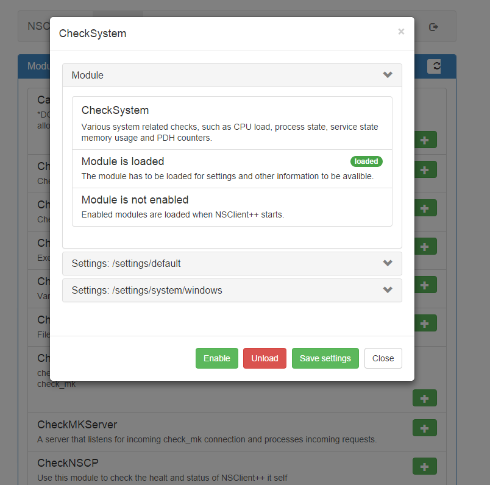

# What's New in NSClient++ 0.4.3 #

The main goals of the 0.4.3 was stability and fix all outstanding issues and annoyances and any new issues from 0.4.2.

- Enhanced Usability
- Bug-fixes
- WEB UI
- REST Support
- Deprecated insecure legacy check_nrpe SSL
- Linux Packages

!!! danger "PLEASE NOTE"
    NRPE has been changed, for details read below.

## Enhanced Usability ##

A lot of effort has been spent on making command line syntax behave better and more consistently and allow to easily configure things.

## Bug-fixes  ##

A lot of bugs have been fixed especially in terms of compatibility with older commands.
The modules have been changed to use shared code which reduces the memory consumption by up to 50%.
Lastly the usual bug fixes and enhancements: see change-log for details.

## WEB UI ##

A brand new web UI has been added which will make configuring and administrating NSClient++ much easier.



With the advent of the new webui which features a web version of the really nifty "test mode" client the client has been enhanced to support a lot of new features.
Such as listing commands, modules, loading/unloading modules and so on and so forth.

## REST Support ##

The main goal for the webui was really to create a REST API.
The webui is fully REST driven which means anything you can do in the webui you can also do on your own from a script or central station.
The current REST API is experimental which means it will likely change in various small ways. This is to make it more REST like and not so protocol buffer like (which means things will become simpler).

A simple REST call can look something along the following lines:

```
curl
   --insecure
   --header "password: PASSWORD"
   https://localhost:8443/query/check_cpu?show-all
```

## NRPE enhancements ##

I have spent a lot of time enhancing the NRPE experience for instance the multi package patch is enabled by default.
Adding security and certificates is now much easier.
And there is a command line client for configuring NRPE.
The WEB-ui has the same thing and this will be coming to many more places so keep looking out for it.

```
nscp nrpe install
Enabling NRPE via SSH from: 127.0.0.1
NRPE is currently reasonably secure using ${certificate-path}/certificate.pem.
Arguments are NOT allowed.
```

!!! danger "Breaking change:"
    no out-of-the box support for NRPE legacy

**If you are using NRPE you are in for a chock!**

In 0.4.3 we will no longer support the rather insecure regular NRPE!
You can still enable support but you have to do so (in the installer or using the command line mode).
So keep a heads up when you run the installer so you wont miss it.

The idea is that when NSClient++ ships a new check_nrpe will be provided which wont have the limitations of the old one.

## Dot-net love! ##

Dot net has received some well deserved love and now actually works, there is even built-in protobuf support which means you no longer need to hand craft messages or use JSON.
We also proved and build a sample plugin so you can see how to do it.
I think this is the longest overdue feature.

## JSON! ##

All protobuf messages now map directly to corresponding protobuf messages which means you can now if you like use JSON for everything instead of protobuf if you are writing scripts.
