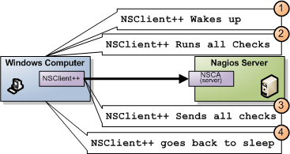
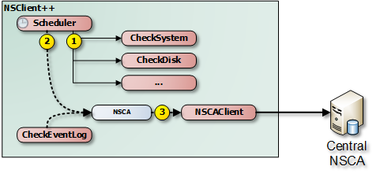
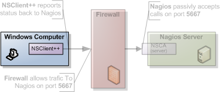
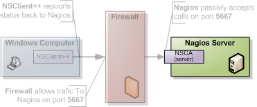
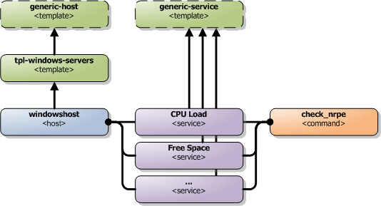

# Using NSClient++ with NSCA #

NSCA (Nagios Service Check Acceptor) is a protocol which is used in reveres of the other common Nagios protocol NRPE.
The idea is that you can submit passive check results to a Nagios server instead of having the Nagios server actively polling.
Thus to utilize NSCA you need to install a NSCA compatible server on your central Nagios monitoring server (or similar solution).

Passive in this context means that Nagios is not the initiator of the actual check commands.
Instead the client (when it is configure to do so) will submit the results to Nagios (thus it will initiate the data transfer).
If you compare the above image with the one used with NRPE you will notice that the arrow points from the client to Nagios whereas the NRPE one points from Nagios to your client.

## Overview of NSCA



As I stated initially NSCA is "sort of the reverse" of NRPE and the diagram above illustrates the process by which Nagios receives the check results.

1. NSClient++ decides it is time to run checks
2. NSClient++ gathers all results
3. NSClient++ connect to NSCA (server) and sends all results
4. NSClient++ goes back to sleep

For regular checks this might seem like a firewall versus configuration question but when it comes to **real time monitoring** it have a bigger impact as you can get the error much quicker since there is no polling interval involved hence you gain the ability to react to problems faster.

# NSClient++



In NSClient++ NSCA requires at least two components to work.
We need (in the regular check case) a scheduler who runs the checks as well as the `NSCAClient` which forwards the results to the central server.
Depending on your scenario you can replace (or extend) the `Scheduler` with various real-time able modules such as `CheckLogFile` and `CheckEventLog`.
The internals of NSClient++ when it comes to passive checks is depicted here.

1. The normal process is for the scheduler to execute the commands (using the normal check modules).
2. Send the results to NSCA channel (NSCAClient)
3. Send the message to the central NSCA server

The channel sits in between the sender (Scheduler) and the recipient (NSCAClient).
You can think of the channel as a queue or mail box.
Thus anyone (including your custom script from `PythonScript` and `LuaScript`) can recive and publish messages to your message box which the `NSCAClient` will pick up and deliver to the central Nagios server.

The name of the channel which in this case (the default) is NSCA is just a string (a..ZA..Z) but used to identify the recipient like an address on the evenlope when you send a letter or email address when you send an email (though I guess email addresses are a bit more magical).
Thus you can, if you choose, use any string though I would recommend using NSCA in this case since it will keep your configuration down.

It is very possible to have multiple `NSCAClient` modules setup to listen to different channels so if you need to send different results to different servers (or multiple servers) that would be one option.

## NSClient++ configuration



Since NSCA is a server we shall start by configuring NSClient++ as thats were most things will happen.
Also since this is an "advanced" guide it is assumed you have read at least the [NRPE guide](nrpe) and are familiar with the basic working of both Nagios and NSClient++.

### Modules

The first thing you do is to make sure you have all the proper modules loaded.
This scenario here assumes you want to run simple checks and submit there results similar to how active check results are handled via for instance NRPE for more advanced scenarios refer to later section in this guide.
We need the basic modules for basic checks in addition to the [`Scheduler <Scheduler>`_] and the [`NSCAClient <NSCAClient>`_].

So lets start with the following modules:

| Module               | Description                                                       | Commands                    |
|----------------------|-------------------------------------------------------------------|-----------------------------|
| CheckSystem          | Handles many system checks                                        | check_cpu, check_memory etc |
| CheckDisk            | Handles Disk related checks                                       | check_drivesize             |
| CheckExternalScripts | Handles aliases (which is what we will use) and external scripts. | N/A                         |
| NRPEServer           | Listens and responds to incoming requests from Nagios via NRPE    | N/A                         |
| ...                  | There are a lot more modules                                      | ...                          |

The resulting modules section in nsclient.ini will look like so:

```
[/modules]
CheckSystem=enabled
CheckDisk=enabled
CheckExternalScripts=enabled
CheckHelpers=enabled

Scheduler=enabled
NSCAClient=enabled
```

### Scheduler Configuration

Then we move on to configure the Scheduler which will run our commands at a given schedule.
The scheduler in it self has little we need to configure apart from the schedules.

### Containers

Configuring schedules is a fairly straight forward but there is some theory involved which I will cover here.
It is strictly not necessary to understand this but I think it is helpful so feel free to skip this section if you want.
A schedule uses a container concept in the NSClient++ configuration this means that you configure a "container" all containers have a built-in templating system where a section inherits from a parent section.
By default all section inherit from a "default section".
So a good way to add a bit of magic to your configuration is to set everything common on a template and magically watch all options passed down to their children.

The other thing worth mentioning about containers is that they can be configure in long or short mode. Short mode looks like this:

```
[/settings/scheduler/schedules]
foo=bar
alias=command
```

The same section using long format looks like this:

```
[/settings/scheduler/schedules/foo]
command=bar

[/settings/scheduler/schedules/alias]
command=command
```

The upside to the short format is that you can configure a massive number of schedules as a single lines the drawback is that you can only configure the command.
So if you need to configure you commands individually you are forced to use the long format.
From NSClient++ perspective they will get treated the same.

## Adding Schedules

The simple way to add schedules (which we will use) is to add a default template where you configure all options and then use the short format where you only specify the command.
For each command you can configure a number of options such as

* interval
  Perhaps the most important option. It controls the interval which NSClient++ will use when it runs the checks in essence this is the amount of time between a check will be submitted to Nagios (via NSCA). Since there is only one of these it will not be possible to have individual intervals for various checks instead all checks will be submitted using this interval.
  It is a good idea to set this **LOW** when you are debugging things as you will have to wit for this to fire before anything happens.
* alias
  The name of the check to report this is defaulted to the key/section name.  *Since we use the short hand format we set this via the key*.
* channel
  The target channel to report result to (defaults to NSCA)
* report
  A filter if you only want to report errors and not ok statuses for instance.
* command
  The command to execute and report back the result from. *Since we use the short hand format we set this via the value*.

In our example we will be using the various aliases exposed by [`CheckExternalScripts <CheckExternalScripts>`_] so we wont have to add so many arguments in the configuration. Thus we end up with the following:

```
[/settings/scheduler/schedules/default]
interval=5m

[/settings/scheduler/schedules]
cpu=alias_cpu
mem=alias_mem
disk=alias_disk
service=alias_service
```

## NSCAClient Configuration

Now we have a scheduler running our checks every 5 minutes but this means every 5 minutes it will report a lot of errors since we have yet to configure a recipient for the NSCA channel.
To do this we need to load the NSCAClient module and configure it to successfully connect to our central NSCA server.
When it comes to servers we again have the same container concept as before only this time the normal thing to do is to skip it entirely and just use the "default target" since most people only require a single NSCA server setup. But it is entirely possible to use templates, short hands and what not but if you want to make your life complicated.

* encryption
  The encryption algorithm to use. It is often a good idea to set this to 0 (None) when you try this out as it will reduce the number things which might be broken. If you have the incorrect one it will be hard to know what is wrong. For production I would recommend against using xor or none and the various weak algorithms such as des/3des.
  I myself tend to opt for using 14 (AES) at is a common enough algorithm.
* password
  The password is the "secret" you share with NSCA it has to be the same on both ends (or again like with encryption) nothing will work.
* address
  This is the IP address (and port) of the NSCA server (often the same as the Nagios server).
  This will **not** default to the allowed_hosts directive so you HAVE to specify this option.

In addition to configuring the connection details for the central NSCA server we can also configure which channel to listen on as well as the rather important hostname property.

* hostname
  The hostname is the name your machine has.
  This has to match the name used in Nagios for this thus often (unless hostnames match) you might have to tweak this.
  The default hostname is *auto* which will be replaced with the host name of the machine.
  You can also use ''auto-lc'' to use the lower case version of the host name.
  In addition to these hard coded values you can also use an expression where you can use ${host} and ${domain} to create a custom name such as ''win_${host}'' if you have a prefix suffix in use.

The resulting configuration will look something like this:

```
[/settings/NSCA/client]
hostname=win_${host}

[/settings/NSCA/client/targets/default]
address=1.2.3.4
encryption=aes
password=unbreakable
```

# NSCA Server



How to configure NSCA falls a bit outside the scope of this tutorial but it is pretty straight forward and a quick walk through is provided here.

Don't forget the "debug=1" in /etc/nsca.conf

**TODO**

## Testing and Debugging

The most important thing to understand when diagnosing errors and finding configuration problems is that most often they are related to client/server communication.
And the way NSCA is designed it silently ignores this so there is no real way to know if it worked or not (from NSClient++ side) so to find if it works you always need to go to the server.

Thus the first thing to check is the syslog (or where you have your log configured).

```
sudo tail -f /var/log/syslog
```

will result in the following:

```
Jul 12 19:35:20 localhost nsca: Connection from 192.168.0.104 port 26117
Jul 12 19:35:20 localhost nsca: Handling the connection...
Jul 12 19:35:21 localhost nsca: Received invalid packet type/version from client
```

* possibly due to client using wrong password or crypto algorithm?

And this is clue that we have indeed miss configured NSCA. Most often it is either invalid password or the wrong encryption.

If things are working you should see the following:

```
Jul 12 19:47:01 localhost nsca: Connection from 192.168.0.104 port 8198
Jul 12 19:47:01 localhost nsca: Handling the connection...
Jul 12 19:47:02 localhost nsca: SERVICE CHECK -> Host Name: 'DESKTOP',
Service Description: 'CPU Load', Return Code: '0',
Output: 'OK CPU Load ok.|'5m'=0%;80;90; '1m'=1%;80;90; '30s'=3%;80;90; '
Jul 12 19:47:02 localhost nsca: HOST CHECK -> Host Name: 'DESKTOP',
Return Code: '0', Output: 'Everything is fine|'
Jul 12 19:47:02 localhost nsca: End of connection...
```

# Configure Nagios



Nagios configuration is in itself a whole chapter and this is just a quick peek on how you can do things.
First off there are a few concepts to understand:

* templates are the same as the corresponding item but they have a flag register = 0 which makes them "unlistable items"
* services are essentially checks (is check CPU)
* hosts are essentially computers
* groups are an important concept which I ignore here for simplicity (I recommend you use it)

The configuration is at the end layer quite simple you have a "check" and a "host" and you connect them with a service.
Like I show at the bottom line in the diagram above.
Whats makes this a tad more complicated is that you can inherit things from a "parent" definition.
Which is what I show with arrows (bottom to top) above. The templates with dashed lines are the base templates which all services and hosts inherit.

## Passive Checks

The main difference between passive checks and active checks are the following two flags:
* active_checks_enabled
  Active service checks are enabled
* passive_checks_enabled
  Passive service checks are enabled/accepted

So adding the following will "change" an active check to a passive check.

```
...
active_checks_enabled    0 ; Active service checks are enabled
passive_checks_enabled    1 ; Passive service checks are enabled/accepted
...
```

So you say what shall I enter for command for my passive checks?

There are several options for this depending on what you want I wont (as always) go into the details in this quick guide but the short of it is either you use check_dummy or you use the actual command and setup freshness checks.
With freshness checks active it means that if a result is not submitted Nagios will actively go out and seek the information (this is what I would recommend for host checks at least).

## Template

First, its best practice to create a new template for each different type of host you'll be monitoring.
Let's create a new template for windows servers.

```
define host {
  name                  tpl-windows-servers ; Name of this template
  use                   generic-host ; Inherit default values
  check_period          24x7
  check_interval        5
  retry_interval        1
  max_check_attempts    10
  check_command         check-host-alive
  notification_period   24x7
  notification_interval 30
  notification_options  d,r
  contact_groups        admins
  register              0 ; DONT REGISTER THIS - ITS A TEMPLATE
}
```

Notice that the tpl-windows-servers template definition is inheriting default values from the generic-host template, which is defined in the sample localhost.cfg file that gets installed when you follow the Nagios quick-start installation guide.

## Host definition

Next we need to define a new host for the remote windows server that references the newly created tpl-windows-servers host template.

```
define host {
    use                    tpl-windows-servers ; Inherit default values from a template
    host_name              windowshost ; The name we're giving to this server
    alias                  My First Windows Server ; A longer name for the server
    address                10.0.0.2 ; IP address of the server
    active_checks_enabled  0 ; Active host checks are enabled
    passive_checks_enabled 1 ; Passive host checks are enabled/accepted
}
```

Defining a service for monitoring the remote Windows server.

## Service definitions

The following service will monitor the CPU load on the remote host.
The "alias_cpu" argument which is passed to the check_nrpe command definition tells NSClient++ to run the "alias_cpu" command as defined in the alias section of the nsclient.ini file.

```
define service {
    use                     generic-service
    host_name               windowshost
    service_description     CPU Load
    check_command           check_nrpe!alias_cpu
    active_checks_enabled   0 ; Active service checks are enabled
    passive_checks_enabled  1 ; Passive service checks are enabled/accepted
}
```

The following service will monitor the free drive space on /dev/hda1 on the remote host.

```
define service {
    use                     generic-service
    host_name               windowshost
    service_description     Free Space
    check_command           check_nrpe!alias_disk
    active_checks_enabled   0 ; Active service checks are enabled
    passive_checks_enabled  1 ; Passive service checks are enabled/accepted
}
```

Now a better way here is to add a new template and derive the service checks for a "tpl-passive-service" instead and put the passive options there but alas I was to lazy to do so in this quick guide.
